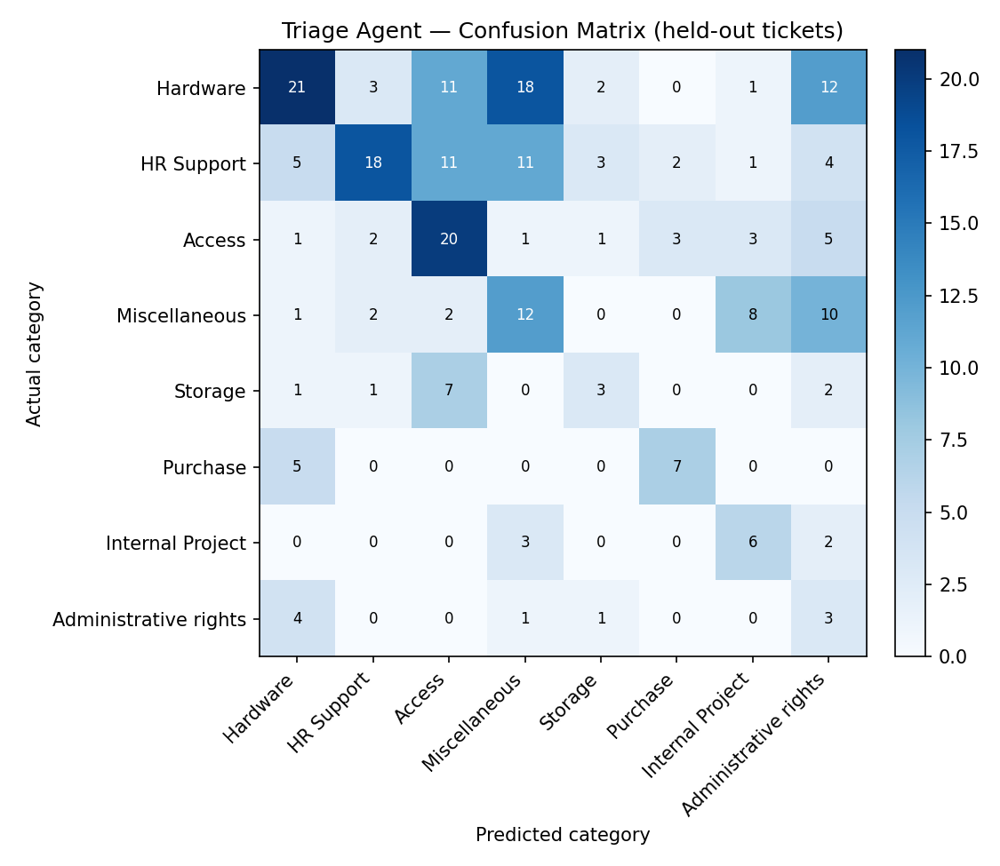

# AI-Augmented Ticket Triage Agent
### Phase 3 — following the IT Service Ticket Classification (Phase 1) and the Storage Self-Service BRD (Phase 2)

## Personal Portfolio Project
This is a self-directed practice project, not a real client engagement or employer deliverable. It builds on the same public Kaggle ticket dataset used in Phase 1. It is presented to demonstrate both business-analysis method and applied AI-agent development.

## How this connects to Phase 1 & 2
Phase 1 ([IT Service Ticket Classification](https://github.com/bhavna-rao/it-ticket-volume-complexity-analysis)) found that Storage-category tickets were low-volume (5.8% of 4,000 sampled tickets) and the least complex category of all eight — the strongest candidate to automate first. Phase 2 ([Storage Self-Service BRD](https://github.com/bhavna-rao/it-storage-selfservice-portal-phase2)) turned that finding into formal requirements for a self-service portal.

This agent operationalizes a small piece of that idea: given a new ticket's text, can an AI model correctly identify which of the 8 categories it belongs to — and specifically, can it reliably spot the Storage tickets that Phase 2 proposed routing to self-service? A working, evaluated agent is a more concrete proof point than the idea alone.

**Why this specific question, next:** Phase 2's future-state design still depends on one manual step — someone (the requester, or an IT agent triaging an incoming ticket) has to first recognize a request as a Storage issue before it ever reaches the self-service form. Phase 3 tested whether AI could remove exactly that step, by reading a ticket's raw free text and identifying it as Storage on its own, with no one pre-labeling it. That made it the natural next question to test, not an arbitrary one: Storage was already the category Phase 1 and Phase 2 identified as the strongest, lowest-risk candidate for automation, so removing its one remaining manual step was the direct next opportunity worth evaluating.

## What it does
1. Loads the same 4,000-ticket sample used in Phase 1.
2. Splits it into a training pool (used only to build 16 few-shot examples, 2 per category) and a held-out test set the agent never sees labels for.
3. Sends the held-out tickets to Claude in small batches and asks it to classify each into one of the 8 known categories.
4. Scores every prediction against the real label — on data the model never had access to — and reports overall accuracy, a per-category precision/recall breakdown, and a confusion matrix.
5. Flags any ticket predicted as "Storage" as a self-service candidate, directly tying back to the Phase 1 finding and the Phase 2 BRD's scope.

## Results
Evaluated on 240 held-out tickets (6% of the 4,000-ticket sample), stratified across all 8 categories, using Claude Haiku with 16 few-shot examples. The model never saw the labels for these 240 tickets before being scored.

**Overall accuracy: 37.5%** — about 3x better than the 12.5% random-guess baseline for an 8-category problem, but not high in absolute terms.

| Category | Precision | Recall | F1 | Support |
|---|---|---|---|---|
| Hardware | 0.55 | 0.31 | 0.40 | 68 |
| HR Support | 0.69 | 0.33 | 0.44 | 55 |
| Access | 0.39 | 0.56 | 0.46 | 36 |
| Miscellaneous | 0.26 | 0.34 | 0.30 | 35 |
| Storage | 0.30 | 0.21 | 0.25 | 14 |
| Purchase | 0.58 | 0.58 | 0.58 | 12 |
| Internal Project | 0.32 | 0.55 | 0.40 | 11 |
| Administrative rights | 0.08 | 0.33 | 0.13 | 9 |

**Self-service flagging specifically:** of the 14 real Storage tickets in the test set, the agent correctly flagged 3 (21% recall). Of the 10 tickets it flagged as self-service candidates overall, 3 were genuinely Storage (30% precision) — the rest were mostly misclassified as Storage when they were actually Access-category requests, which use similar wording (account/permission-adjacent language).

## Improvement testing (done after the original run above)

The 37.5% result above was a single, untested attempt — one prompt, one model, 2 few-shot examples per category, tried once. Rather than leave it there, four follow-up tests were run on the same 240-ticket held-out set, so the results are directly comparable. Full step-by-step detail, real examples with row numbers, and interview-ready summaries for each one are in `Phase3_Testing_Walkthrough.docx`; the full 240-ticket comparison (every ticket, every method's guess, side by side) is in `Phase3_240_Test_Tickets.xlsx`.

1. **Non-AI baseline (TF-IDF + Naive Bayes), same 240 tickets: 63.3% accuracy** — well above the AI agent. Mainly because it learned from 3,760 labeled examples versus the AI's 16, not because it's a smarter method. This is the honest answer to "was AI even the right tool here" — for a text-classification problem with this much labeled data available, a classical method beat the AI agent.
2. **Re-ran the AI agent with 8 few-shot examples per category instead of 2: accuracy rose from 37.5% to 42.9% overall.** Storage specifically — the category this project is built around — rose from 3/14 to 11/14 correct. More labeled examples helped meaningfully, especially for Storage, but the AI agent still didn't catch up to the simple baseline.
3. **The "heavily pre-processed text" theory below was tested, not just assumed — and it turned out not to be the explanation.** A statistical test (Mann-Whitney U) compared the length of tickets the AI got right versus wrong, and found no significant difference (p = 0.66). So text pre-processing alone doesn't explain the error rate; the more likely factors are limited few-shot examples and genuine overlap between categories like Storage and Access.
4. **Spot-checked 8 of the AI's "wrong" answers against the original labels myself, reading each ticket blind before seeing the label or the AI's guess.** In 4 of 8, my own independent read agreed with the AI over the original dataset label — some of the reported error rate reflects inconsistent original labeling, not pure AI failure.

**Why accuracy wasn't higher on the original run, honestly:** not primarily because the text is pre-processed (that theory was tested above and ruled out). The bigger factors, confirmed by the testing above: too few labeled examples (2 per category, versus the baseline's 3,760), and real wording overlap between categories like Storage and Access. Giving the agent more examples (test #2 above) closed part of that gap; a non-AI method trained on the full labeled pool closed it further (test #1). Likely next steps to improve this further: even more few-shot examples, a larger model, or fine-tuning on labeled examples — noted as future work rather than done here.

## Skills demonstrated
**Business/domain (mine):** tracing the agent's logic directly back to a real data finding (Phase 1) and a real requirements document (Phase 2); defining what "self-service eligible" means in a way consistent with the BRD's scope; designing the evaluation approach (a proper held-out test set, not just eyeballing a few examples) so the accuracy numbers are honest.

**AI-directed development:** I designed the agent's logic, the few-shot approach, and the evaluation method; Claude AI implemented it in Python at my direction, and every result was reviewed and validated against the dataset before being reported. Same approach as the DAX/MCP disclosure on Phase 1 — I don't write Python myself, but I can direct, evaluate, and validate an AI-built tool against real data.

## Tools Used
Python (implemented with Claude AI direction) · Anthropic Claude API · pandas · scikit-learn (train/test split, metrics) · matplotlib (confusion matrix chart) · Kaggle (data source, via Phase 1)

## How to reproduce this
1. Get an Anthropic API key from console.anthropic.com.
2. `pip install -r requirements.txt`
3. Set the key as an environment variable: `export ANTHROPIC_API_KEY=your-key-here` (never hard-code it in a file).
4. `python triage_agent.py`
5. Results are saved to `results/predictions.csv`, `results/metrics.json`, and `results/confusion_matrix.png`.

## Honesty notes
- The test set is a held-out sample of 240 tickets (6% of the 4,000), not the full dataset — kept small to control API cost and runtime for a portfolio-scale evaluation. The split is stratified, so all 8 categories are represented proportionally.
- This is a classification prototype, not a production triage system. It isn't connected to a real service desk, and no claim is made that it's deployed anywhere.

## Files in this repo
- `triage_agent.py` — the full pipeline: data split, few-shot prompt construction, batched classification, evaluation, and chart generation
- `data/it_tickets_sample_4000.csv` — the same 4,000-ticket sample used in Phase 1
- `results/` — evaluation outputs from the original run (predictions, metrics, confusion matrix chart)
- `requirements.txt` — Python dependencies
- `Phase3_Improvement_Plan.docx` — the 6-item honest critique of the original run, and how each item was tested and closed
- `Phase3_Testing_Walkthrough.docx` — step-by-step detail on every improvement test, with real examples, row numbers, and interview-ready summaries
- `Phase3_240_Test_Tickets.xlsx` — all 240 held-out tickets with every method's prediction (original AI, 8-shot AI, non-AI baseline) side by side

## Note
This is a personal, self-directed portfolio project — Phase 3 of a multi-part initiative — built on a public dataset and a real finding from Phase 1/2. It does not represent real company data, a client engagement, or professional work experience.
